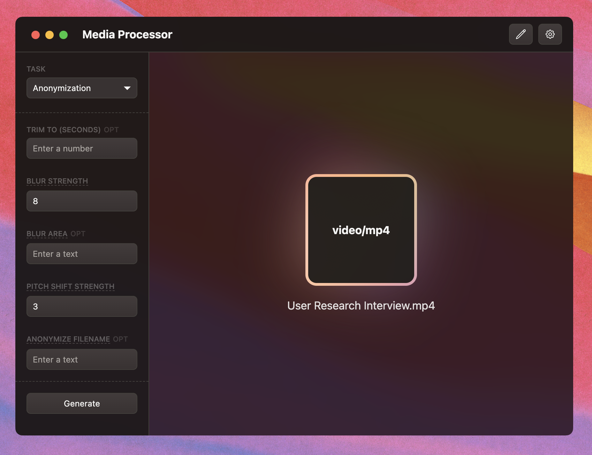

<p align="center">

</p>

# Media Processor 📼

This is a MacOS desktop app that allows you to process media in various ways. It's built with [Electron](https://www.electronjs.org/) and [React](https://reactjs.org/). The project was created to streamline the user research operations at [Amay Health](https://www.amayhealth.com). It's currently supporting these transformations:

- [x] Compress video and audio files
- [x] Transcribe video and audio files using [Deepgram](https://www.deepgram.com/)
- [x] Anonymize video and audio files by blurring the video and pitch shifting the audio
- [x] Run Named Entity Recognition (NER) on the transcript to identify people, places, and organizations
- [x] Redact video files, audio files as well as transcripts
- [x] Export the transcript to Notion-friendly markdown format

## Getting Started

To get started using the app, just clone the repo, install the dependencies and build the app.

### Package Manager

The repository uses `yarn` as the package manager. To check whether `yarn` is already installed, run this command in your terminal:

```bash
yarn --version
```

If it is not yet installed, you can install it with this command:

```bash
npm install --global yarn
```

[Learn more here about yarn.](https://classic.yarnpkg.com/lang/en/docs/install/#mac-stable)

### Dependencies

Install all the required dependencies by running this command in the project directory:

```bash
yarn
```

### Build

To build the app, run this command in the project directory:

```bash
yarn make
```

This will create a `out` folder in the project directory. Inside the `out` folder, you will find the `Media Processor.app` file. You can now run the app by double clicking on the `Media Processor.app` file.

## Development

To start the app in development mode, run this command in the project directory:

```bash
yarn start
```

This will open the app in a new window. You can now make changes to the front-end code and the app will automatically reload. Note that you will have to restart the app if you make changes to the back-end code.

## Feature Deep Dive

### Media Transformations

The app contains all the necessary dependencies for `ffmpeg`, so no need to install it separately. The app uses the `ffmpeg` command line tool to perform the media transformations. The `ffmpeg` command line tool is a powerful tool that can do a lot of things. You can learn more about it [here](https://ffmpeg.org/).

### Transcription

The app uses [Deepgram](https://www.deepgram.com/) to transcribe video and audio files. You will need to create a Deepgram account and get an API key to use the transcription feature. You can create a Deepgram account [here](https://console.deepgram.com/signup). Once you have created an account, you can get your API key on the console's dashboard screen. Copy the API key and paste it in the `DEEPGRAM API KEY` input in the app's settings. Note that this value will be stored in plain text in the app's settings file.

### Named Entity Recognition (NER)

The app uses [flair](https://github.com/flairNLP/flair) to perform NER on the transcript. Flair is a powerful NLP library that is used to identify people, places, and organizations in text. Since the models are quite large, I have decided not to bundle the script code in the app. Instead, the app will prompt you to drag and drop an `NER` folder that points to directory containing the `NER` script.

The project contains the `ner` folder in the root of the repository. Since the script is written in Python, make sure that you have Python installed on your machine. You can download Python [here](https://www.python.org/downloads/). Python should come pre-installed on MacOS. You can check whether Python is installed by running this command in your terminal:

```bash
python3 --version
```

The transcription process produces a `sentences.txt` file which is optimized for the NER script. The NER script will read the `sentences.txt` file and the `ner` folder and produce a `ner-analysis.txt` file which contains the identified entities.

### Redaction

The app makes it very easy to anonymize audio and transcript files. To redact a piece of information, load the media file into the app, press the `Edit Redaction Config` command from the `Redaction` task option and drop the generated `transcription` folder into the new editor window.

To redact a piece of information, you will need to surround the piece of text with square brackets and provide an alternative text in round brackets after the square brackets. The editor is built from [Monaco](https://github.com/microsoft/monaco-editor), so you will get most of its features like find and replace, syntax highlighting, etc.

Example:

```markdown
I went shopping today with [Michael](a friend) at [Target](a Grocery Store).
```

This will redact the names `Michael` and `Target` from the transcript and replace them with `a friend` and `Grocery Store` respectively.

```
I went shopping today with a friend at Grocery Store.
```

The corresponding audio file will also be redacted.

Please not that any changes to the text content outside of these changes will not be respected. So if you want to edit the transcript, please do so using the general text editor from the main app window.

### Export

Currently, the script is only exporting files to a folder on your machine. In the future, I would like to add the ability to export media files and transcripts straight to Notion or AWS.

## Trouble Shooting

If you encounter this error when starting the app using `yarn start`:

```

...
const stringWidth = require('string-width');
...

```

then you just have to delete the `node_modules` folder and install the dependencies again. You can use the command below to do that:

```bash
yarn nuke
```
